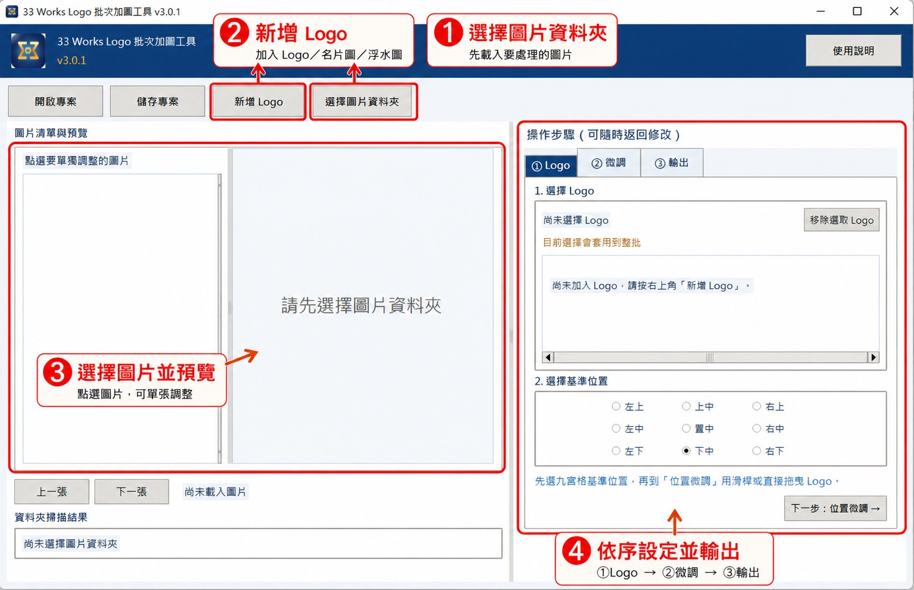

# 33 Works Logo 批次加圖工具 V3.1.0

一套從實際工作流程出發製作的免費圖片批次工具。

- 免費公開使用
- 不需要通行碼
- 不綁定裝置
- 圖片全程在本機處理
- 支援整批與單張例外設定
- 支援專案保存與單張重做

## 下載

目前正式定稿版本為 **V3.1.0**。

> V3.1.0 下載包請放置於 `downloads/33_Works_Logo_Batch_Tool_V3.1.0.zip` 後，公開下載連結即可固定使用該檔案。

下載後解壓縮，執行 `run_tool.bat`。第一次使用前請先安裝 Python 3.10 以上版本。

## 主要功能

- 批次加入 Logo、名片圖或浮水圖
- 九宮格快速定位
- 直接拖曳 Logo
- 調整大小、邊距、不透明度與位移
- 每張圖片可使用不同 Logo
- 複製目前設定並貼到指定多張圖片
- 儲存與開啟 `.lbp` 專案
- 批次重新命名
- 保持原格式，或統一輸出 PNG、JPG、WebP
- 只重做目前這張，不必整批重跑
- 不覆蓋原始圖片

## 使用說明

### 快速上手教學圖

### 實際操作面板步驟圖

### 操作流程

#### 1. 選擇圖片資料夾

點選上方「選擇圖片資料夾」，載入要處理的圖片。

#### 2. ① Logo

- 新增或選擇 Logo
- 選擇九宮格基準位置
- 預設會套用到整批圖片

#### 3. ② 微調

- 調整 Logo 大小、邊距與不透明度
- 可直接拖曳預覽中的 Logo
- 可啟用單張例外設定
- 四個快速按鈕：儲存單張、還原整批、複製設定、貼到選取圖片

#### 4. ③ 輸出

- 設定批次名稱
- 選擇輸出格式
- 選擇輸出資料夾
- 執行整批輸出
- 也可只重做目前這張

## 執行方式

### 一般使用

1. 下載並解壓縮工具包
2. 確認已安裝 Python 3.10 以上版本
3. 執行 `run_tool.bat`

### 建置 Windows 執行檔

如需自行建置 Windows 執行檔，可執行 `build_windows_exe.bat`。

## 回饋與更新

本工具免費公開使用。設立目的，是把我自己實際工作中常用的批次加圖流程整理成公開工具，讓有相同需求的人也能更快完成圖片處理。

若你在實際使用後發現不好操作的地方、希望增加功能，或想收到新版通知，歡迎加入：

- LINE 官方：`@791gqyyp`
- [直接加入 LINE 官方](https://lin.ee/Vyx52S4)

如果你願意支持工具持續更新、維護與後續改善，也可以自由使用綠界贊助：

- [前往綠界支持工具持續更新](https://payment.ecpay.com.tw/QuickCollect/PayData?UV8kunudvpag0i8o5BpVheak%2blji826yhTg%2f3%2bI2iDo%3d)

## 專案定位

這個工具採公開軟體方向發展。重點不是限制使用，而是透過真實回饋持續改善工作流程。
